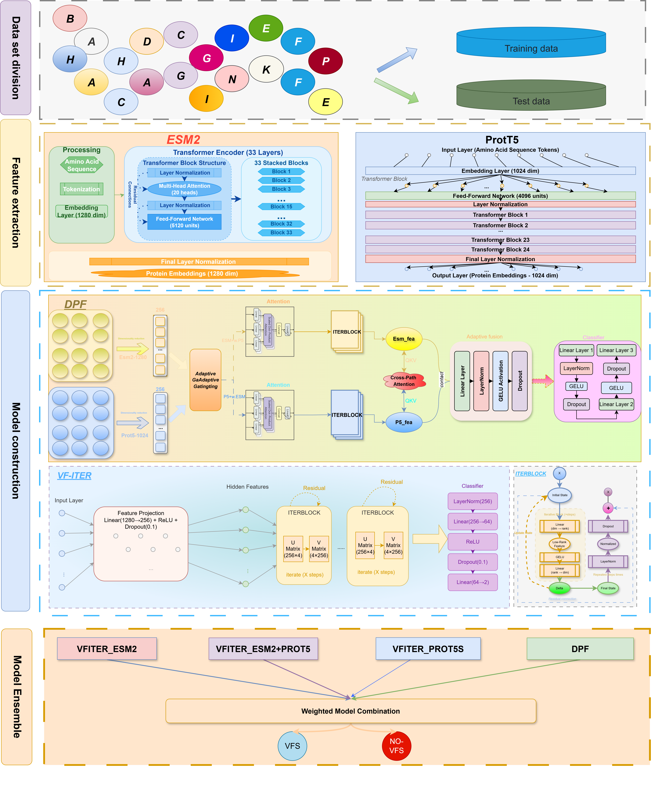

# VF-FUSE: **A Dual-Path Feature Fusion and Iterative Update Architecture for Virulence Factor Prediction**

This repository contains the code for the paper submission, featuring a fusion approach based on protein language models (PLMs) and traditional features for protein function prediction.


## Framework Overview



*Figure: The overall architecture of VF-FUSE, integrating PLM embeddings and traditional features for protein function prediction.*

## Directory Structure

- `config.json`: Main configuration file
- `esmmodel.py`: ESM model code
- `get_esm2_embedding.py`: ESM2 embedding extraction script
- `get_prot5.py`: Prot5 embedding extraction script
- `model_type.py`: Model type definitions
- `plm_tune.py`: PLM fine-tuning script
- `plm_val_model.py`: PLM validation script
- `train.py`: Main training program
- `vf_streamlit_app.py`: Streamlit visualization app
- `requirements.txt`: Dependency list
- `best/`: Best models and configs
- `raw_data/`: Raw data files
- `test_data/`: Test data files

## Quick Start

1. Install dependencies:
   ```powershell
   pip install -r requirements.txt
   ```
2. Run training:
   ```powershell
   python train.py
   ```
3. Launch Streamlit app:
   ```powershell
   streamlit run vf_streamlit_app.py
   ```

## Data Description

- `raw_data/` contains FASTA and feature files for training and testing.
- `test_data/` contains embedding data for model inference.

## Main Features

- Fusion of ESM2, Prot5 and other PLM embeddings with traditional features
- Supports model fine-tuning and validation
- Provides visualization interface for prediction results

## Contact

For questions, please contact the author.

## Workflow for Predicting New FASTA Files

Suppose you have a new FASTA file (e.g., `new.fasta`). Follow these steps for protein function prediction:

1. Prepare the FASTA file
   - Save the sequence to `new.fasta` and place it in `raw_data/` or your chosen directory.
2. Generate embedding features
   - ESM2 embedding:
     ```powershell
     python get_esm2_embedding.py --input raw_data/new.fasta --output test_data/new_esm2.h5
     ```
   - Prot5 embedding:
     ```powershell
     python get_prot5.py --input raw_data/new.fasta --output test_data/new_prot5.h5
     ```
3. Predict using the Steamlit app:
   ```powershell
   streamlit run vf_streamlit_app.py
   ```

> Please adjust the script parameters and paths according to your actual setup.

---

This repository is for academic communication and paper reproduction only.

